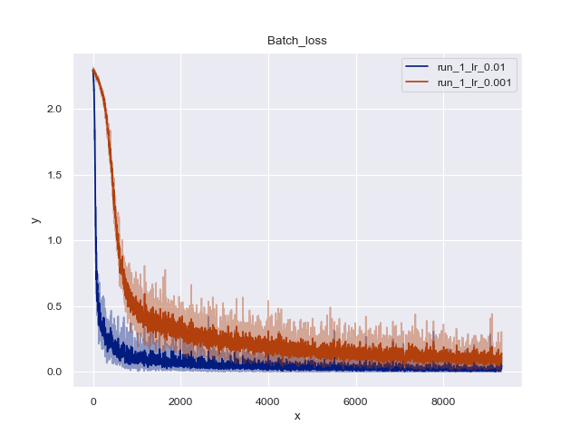

# tensorboard2seaborn 🌈
Plot Tensorflow's Summary event in a beautiful way (using seaborn actually) instead of using Tensorboard.

## Installation
```bash
cd tensorboard2seaborn
python setup.py install
```

## Usage:

#### Terminal:
Example: ```tensorboard2seaborn --logdir=/experiments/logs --smooth=0.95```

```bash
usage: tensorboard2seaborn [-h] [--logdir LOGDIR] [--smooth SMOOTH]
optional arguments:
  -h, --help       show this help message and exit
  --logdir LOGDIR  Path to event files
  --smooth SMOOTH  window size for average smoothing
```

#### Console: 
```python
import tensorboard2seaborn

tensorboard2seaborn.plot(logdir='/experiments/logs')
```

***

_We expect following structure of the tensflow log events._
```bash
└── results
    ├── exp2
    │   └── events.out.tfevents....0
    ├── exp1
    │   └── events.out.tfevents....0
    ├──  ....
```

_Following structure is generated comprising of seaborn graphs_

```bash
└── results
    └── seaborn
        ├── group1
        │   ├── plot1.png
        │   └── plot2.png
        │   └──  ...
        ├── group2
        │   ├── plot1.png
        │   └── plot2.png
        │   └──  ...
```

***

## Demo

| Before | After |
|:---:|:---:|
|||
|||
|||
|||

